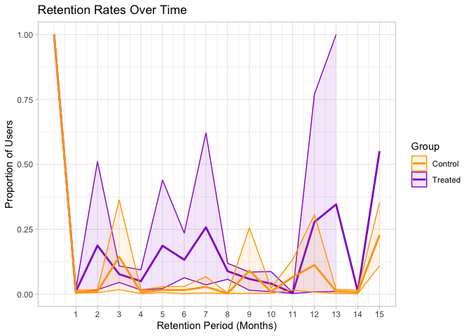

<!-- README.md is generated from README.Rmd. Please edit that file -->

# SocialMediaRetention

<!-- badges: start -->
<!-- badges: end -->

SocialMediaRetention aims to compute the retention rates for two cohorts
of users (for instance, YouTube commenters who interact with videos
released at different periods). Here is an example:
<https://firstmonday.org/ojs/index.php/fm/article/view/12882>

## Installation

You can install the development version of SocialMediaRetention like so:

``` r
devtools::install_github("aidar-zinnatullin/SocialMediaRetention")
```

## Example

This is a basic example which shows you how to solve a common problem:

``` r
library(SocialMediaRetention)
## basic example code
```

What is special about using `README.Rmd` instead of just `README.md`?
You can include R chunks like so:

``` r
load("data/retention_control.Rdata")
load("data/retention_treat.Rdata")
treated_ci_data <- compute_bootstrap_ci(retention_data_treated, n_bootstrap = 100, confidence_intervals = 0.95)
head(treated_ci_data, n = 5)
#> # A tibble: 5 × 4
#>   retention_period   Mean  Lower  Upper
#>              <int>  <dbl>  <dbl>  <dbl>
#> 1                0 0.988  0.977  0.996 
#> 2                1 0.0318 0.0167 0.0434
#> 3                2 0.0336 0.0176 0.0542
#> 4                3 0.0381 0.0204 0.0555
#> 5                4 0.0530 0.0347 0.0757
```

``` r
control_ci_data <- compute_bootstrap_ci(retention_data_control, n_bootstrap = 100, confidence_intervals = 0.95)
head(control_ci_data, n = 5)
#> # A tibble: 5 × 4
#>   retention_period    Mean   Lower   Upper
#>              <int>   <dbl>   <dbl>   <dbl>
#> 1                0 0.992   0.983   0.997  
#> 2                1 0.00786 0.00652 0.00948
#> 3                2 0.00594 0.00386 0.00943
#> 4                3 0.00302 0.00247 0.00370
#> 5                4 0.00247 0.00203 0.00288
```

You’ll still need to render `README.Rmd` regularly, to keep `README.md`
up-to-date. `devtools::build_readme()` is handy for this.

You can also embed plots, for example:



In that case, don’t forget to commit and push the resulting figure
files, so they display on GitHub and CRAN.
