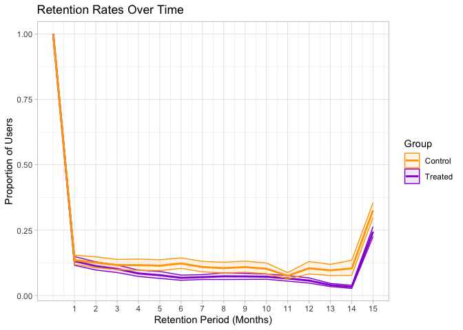

<!-- README.md is generated from README.Rmd. Please edit that file -->

# SocialMediaRetention (Work in Progress)

<!-- badges: start -->
<!-- badges: end -->

`SocialMediaRetention` aims to compute the retention rates for two
cohorts of users (for instance, YouTube commenters who interact with
videos released at different periods).

## Installation

You can install the development version of `SocialMediaRetention` like
so:

``` r
devtools::install_github("aidar-zinnatullin/SocialMediaRetention")
```

## Example

With this package, you can first preprocess social media data by adding
a column that indicates the order of comments for each user based on a
specified time variable.

``` r
library(SocialMediaRetention)
preprocessed_data <- preprocess_comments(test_data, user_id = "authorChannelId", activity_time = "publishedAt")
```

Then, you can identify social media user (e.g., YouTube commenters)
whose first comment was on a video in a specified period of time (e.g.,
treated or control), and who made their first comment within a specified
number of days (parameter `days_after_release`) after the video release.
It then retrieves all comments made by these commenters.

``` r
treated_data <- get_group_data_time(preprocessed_data, group_videos = treated_group, 
                                    days_after_release = 7, activity_time = "publishedAt", 
                                    higher_level_pub_time = "contentDetails.videoPublishedAt", 
                                    higher_level_id =  "Doc_name", user_id = "authorChannelId")
control_data <- get_group_data_time(preprocessed_data, group_videos = control_group, 
                                    days_after_release = 7, activity_time = "publishedAt", 
                                    higher_level_pub_time = "contentDetails.videoPublishedAt", 
                                    higher_level_id =  "Doc_name", user_id = "authorChannelId")
```

We can calculate the retention rates of users (function
`calculate_retention`) over specified time intervals (`intervals`). You
will have to select the column names for the higher-level content’s
publication time (`higher_level_pub_time`) and its ID
(`higher_level_id`), the user’s activity time (e.g., commenting,
parameter `activity_time`) and the user’s ID (`user_id`).

``` r
retention_data_treated <- calculate_retention(treated_data, intervals = seq(30, 450, 30), 
                                              higher_level_pub_time = "contentDetails.videoPublishedAt",
                                              activity_time = "publishedAt", higher_level_id = "Doc_name",
                                              user_id =  "authorChannelId")

retention_data_control <- calculate_retention(control_data, intervals = seq(30, 450, 30), 
                                              higher_level_pub_time = "contentDetails.videoPublishedAt",
                                              activity_time = "publishedAt", higher_level_id = "Doc_name",
                                              user_id =  "authorChannelId")
```

The `compute_bootstrap_ci` function calculates bootstrap-based
confidence intervals for percentage values within a given dataset. It
groups the data by retention_period and applies `the smean.cl.boot`
function from the `Hmisc` package to compute the mean and confidence
limits (Harrell & Harrell, 2019). The function runs `n_bootstrap`
resampling iterations (default is 1000) and uses a specified confidence
level (default is 95 percent). The result is a data frame containing the
computed confidence intervals for each group. The random seed is set for
reproducibility.

``` r
treated_ci_data <- compute_bootstrap_ci(retention_data_treated, n_bootstrap = 100, confidence_intervals = 0.95)
head(treated_ci_data, n = 5)
#> # A tibble: 5 × 4
#>   retention_period    Mean   Lower  Upper
#>              <int>   <dbl>   <dbl>  <dbl>
#> 1                0 1       1       1     
#> 2                1 0.00986 0.00371 0.0161
#> 3                2 0.187   0.0169  0.511 
#> 4                3 0.0768  0.0451  0.108 
#> 5                4 0.0497  0.0160  0.0937
```

``` r
control_ci_data <- compute_bootstrap_ci(retention_data_control, n_bootstrap = 100, confidence_intervals = 0.95)
head(control_ci_data, n = 5)
#> # A tibble: 5 × 4
#>   retention_period    Mean   Lower  Upper
#>              <int>   <dbl>   <dbl>  <dbl>
#> 1                0 0.999   0.997   1     
#> 2                1 0.00864 0.00374 0.0148
#> 3                2 0.0106  0.00532 0.0174
#> 4                3 0.144   0.0174  0.363 
#> 5                4 0.00766 0.00197 0.0166
```

The `visualize_retention` command generates a graph that displays
retention rates. Data and the showcase plot were based on the paper
about YouTube commenters’ activities (Zinnatullin, 2023).

``` r
plot <- visualize_retention(treated_data = progov_treated_yt_n, control_data = progov_control_yt_n)
plot
```



## References

1.  Harrell Jr, F. E., & Harrell Jr, M. F. E. (2019). Package ‘hmisc’.
    CRAN2018, 2019, 235-236,
    <https://cran.uib.no/web/packages/Hmisc/Hmisc.pdf>.

2.  Zinnatullin, A. (2023). Navalny’s direct-casting: Affective
    attunement and polarization in the online community of the most
    vocal Russian opposition politician. First Monday,
    <https://firstmonday.org/ojs/index.php/fm/article/view/12882>.
